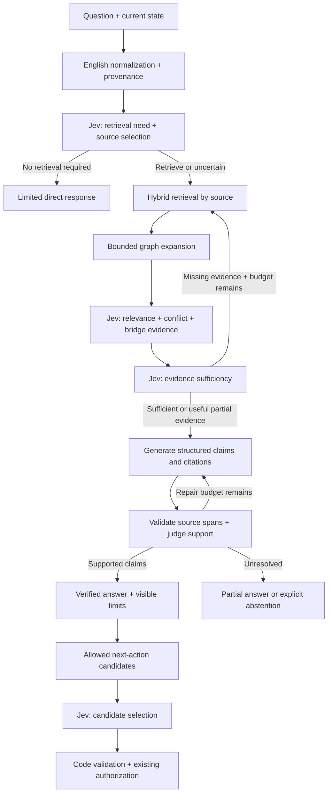

# Jev — graph retrieval, bounded decisions, and evidence-backed answers

Purpose. Advance wiki-agent so questions and current state lead to relevant
documents, memories, and papers; graph relationships recover indirect evidence;
Jev makes bounded decisions; and the answering agent produces supported answers
and appropriate next actions. Completion requires measured improvements over the
current system, live API verification, and the same behavior through the app and CLI.

This is the overall architecture. Stages 1–10 are concrete implementation blueprints.
This request produces the plan. Every implementation stage remains `Not started`;
the existing prototype does not count as a completed stage.

## Requirements and ownership

| User requirement | Required behavior | Stages |
| --- | --- | --- |
| Research existing solutions first | Preserve adopted findings, rejected alternatives, sources, and evaluation conditions | This overview, 3, 10 |
| Advance graph engineering | Relationships change retrieved evidence, with inspectable paths and provenance | 2, 4, 5 |
| Use Jev as a decision controller | Typed decisions for retrieval need, sources, relevance, sufficiency, and next actions | 6, 8 |
| Complete the RAG workflow | Ingest, normalize, index, retrieve, judge, generate, and verify citations | 2–7 |
| Standardize on English | English plans, instructions, questions, decision state, and evidence representations | All stages |
| Make the integration operational | Read the configured `.env`, verify real requests, and connect the product paths | 1, 9, 10 |

The user explicitly requires these plans in English. Original quotations, names,
code, identifiers, and paths remain intact; translated prose never replaces the
source of a citation. Existing Korean UI conventions remain outside the plan's
language requirement.

## Current state

Code inspection on 2026-09-26 establishes the following starting point.

| Area | Existing implementation | Required advancement |
| --- | --- | --- |
| Graph | Policy links and co-injection in `graph.py`; document links, orphans, and maps in `repo_graph.py` | Chunk provenance, semantic relationships, incremental updates, and actual retrieval traversal |
| Retrieval | Heading chunks, BM25, local multilingual embeddings, RRF, and content caches | Chunk-level candidates, source coverage, graph expansion, and ablation results |
| Jev prototype | Noul requests, source routing, reranking, sufficiency, and one wider search | Typed contracts, normalized state, calibrated policies, cancellation, budgets, and replay |
| Answering | `main/query.py` appends a dossier to the generating model's input | Enforced handling of insufficient evidence, claim validation, and no premature answer publication |
| Agents | Work sessions, specifications, approvals, and a review loop | Jev at explicit server-owned decision points, with execution authority checked separately |
| Configuration | `.env` contains a `TYPESAFE_API_KEY` entry | Prototype reads process variables only; file registration is not runtime connectivity |
| Evidence | Simulated controller tests and retrieval regression checks | Live Jev evaluation, baseline comparison, and bilingual meaning preservation |

The key's value is neither displayed nor recorded. Its configured presence is
confirmed; reachability, permissions, and live quality are not. No paid API call
is part of this planning turn.

## End-to-end architecture

The knowledge graph finds evidence. The execution graph determines which function
runs next. A model-generated relationship is not proof that its content is true.

## Pipeline boundaries

| Location | Responsibility |
| --- | --- |
| `tool/common/` | Minimal settings reader and shared values; no model, search, or web imports |
| `tool/translate/` | English normalization and Korean presentation; explicit translation outcome |
| `tool/search/` | Sources, chunks, graph index, and retrieval; no calls into other pipelines |
| New `tool/decision/` | Jev transport, typed validation, policy, budgets, and traces; no retrieval or action execution |
| `tool/agent/` | Generative models and host sessions; reuse existing structured-generation entry points |
| `tool/main/` and root CLI entry points | Compose translate, search, decision, and agent into workflows |
| `tool/repo_graph.py` | Read-only projection of graph evidence into the existing map |
| `web/src/` | Status, evidence, unresolved questions, and cost; no API keys or execution authority |

A separate decision pipeline serves two real consumers: retrieval and agent
selection. Add it to `lint.PIPELINES` and declare its public `__all__`.
Do not expand `search/controller.py` into an orchestrator importing translate or
agent internals. Stage 1 establishes the shared decision transport; stage 6 adds
the complete typed policy and retrieval state machine.

Reuse existing functions before introducing the proposed files. Use the current
process architecture and SQLite; no external graph database or LangGraph runtime
is required for this plan.

## Data ownership

Every evidence item carries `repo_id`, `source_id`, `revision`, `chunk_id`,
and an original locator. Repository identity includes the approved canonical
checkout path, not just its name. A worktree inherits scope only through the
explicit relationship recorded by its specification.

Documents and user memories remain authoritative. Runtime caches and downloaded
research live under the hub's `raw/knowledge/<repo_id>/` or existing user cache.
The server does not write an index, map, or adopted research into an original
checkout. Durable research adoption uses a worktree change and PR. This differs
from a user-directed editing session already operating in that checkout.

Indexes are derived data. Source deletion invalidates chunks, translations,
vectors, and relationships. Full rebuilds write a new generation and publish it
atomically; one answer uses one fixed generation.

## Shared contracts

| Contract | Required content | Authoritative stage |
| --- | --- | --- |
| `EvidenceChunk` | Identity, source kind, original span, English text, translation status, revision | 2 |
| `SourceRecord` | Origin, fetch time, authority, adoption status, visibility, revision | 3 |
| `KnowledgeEdge` | Endpoints, type, direction, provenance, confidence, extractor version | 4 |
| `RetrievalRequest/Result` | Source allowlist, filters, budgets, ranked chunks, expansion paths | 5 |
| `DecisionRequest/Result` | Typed questions, candidate IDs, versions, uncertainty, failure reason | 6 |
| `AnswerDraft/VerifiedAnswer` | Claims, evidence IDs, support status, unresolved requirements | 7 |
| `ActionProposal` | Operation enum, candidate ID, preconditions, owner revision, existing permission | 8 |

The owning stage defines each schema. Other stages request a version change
instead of silently adding incompatible fields. Existing dossiers using
`direct`, `supported`, `insufficient`, or `fallback` remain readable after
the versioned state migration.

## Invariants

1. Jev cannot disable hook rules or grant tool permissions.
2. Uncertainty, HTTP failure, normalization failure, and budget exhaustion are
   separate outcomes. None is converted into a semantic negative.
3. Preserve English evidence alongside its source. Failed normalization cannot
   masquerade as successful English processing.
4. Graph paths discover candidates. Source evidence and explicit decisions
   establish support, contradiction, and supersession.
5. Unverified generated claims cannot appear as final answers or durable memory.
6. Every loop shares an end-to-end deadline, call count, token budget, and
   candidate limit. Per-stage limits cannot multiply the total allowance.
7. Models choose from code-owned candidates; they cannot invent sources,
   capabilities, approvals, or shell commands.
8. Baseline retrieval remains available during a provider outage, while the
   product accurately reports that semantic verification was unavailable.

## Research adopted

The [research record](../../research/jev-retrieval-controller.md) contains the
initial investigation. The following designs guide the full advancement.
Published benchmark numbers are not forecasts for this repository.

| Primary source | Adopted design | Rejected inference |
| --- | --- | --- |
| [TypeSafe passage grading](https://docs.typesafe.ai/cookbooks/classifying_rag_passages) | Distinguish useful evidence, contradictions, and instruction attempts | Relevance proves truth |
| [Jev reranker implementation](https://github.com/hotchpotch/jev-reranker) | Preserve partial answers and bridge facts | Example thresholds transfer without evaluation |
| [Microsoft GraphRAG local search](https://microsoft.github.io/graphrag/query/local_search/) | Retrieve through entities and associated source text | A graph visualization establishes graph retrieval |
| [LangGraph agentic RAG](https://docs.langchain.com/oss/python/langgraph/agentic-rag) | Conditional transitions, document grading, and another search | A new orchestration dependency is necessary |
| [TypeSafe citation checking](https://docs.typesafe.ai/cookbooks/citation_check) | Check quotation existence in code, then judge contextual support | A real quotation automatically supports its attached claim |
| [TypeSafe function calling](https://docs.typesafe.ai/cookbooks/function_calling) | Closed function and argument candidates, validated before execution | Model output is authorization |
| [TypeSafe confidence routing](https://docs.typesafe.ai/patterns/confidence-routing) | Separate uncertainty and calibrate action policies | Probability guarantees correctness |
| [arXiv API](https://info.arxiv.org/help/api/user-manual.html) | First paper provider with identifiers, versions, and abstracts | Connect every paper database and paid full-text source at once |

## Steps

| # | Stage | Deliverable | Status |
| --- | --- | --- | --- |
| 1 | [Runtime and baseline](1-runtime-baseline.md) | Configuration, live connectivity, baseline, and shared budgets | Not started |
| 2 | [English evidence](2-evidence-language.md) | Chunk contracts, normalization, citations, and incremental indexing | Not started |
| 3 | [Source ingestion](3-sources.md) | Documents, memories, papers, and adopted research | In progress |
| 4 | [Knowledge graph](4-knowledge-graph.md) | Structural and semantic relationships with provenance | Done |
| 5 | [Graph retrieval](5-retrieval.md) | Chunk candidates, hybrid ranking, and bounded traversal | Done |
| 6 | [Decision controller](6-decision-controller.md) | Typed routing, grading, sufficiency, and calibrated fallback | Done |
| 7 | [Grounded answers](7-grounded-answer.md) | Claim structure, citation checks, repair, and abstention | Done |
| 8 | [Agent decisions](8-agent-decisions.md) | Server-owned choices, preconditions, execution, and outcomes | Not started |
| 9 | [Product and observability](9-product-observability.md) | Settings, map paths, evidence, trace, reconnection, and cost | Not started |
| 10 | [Evaluation and rollout](10-evaluation-rollout.md) | Ablations, live evaluation, window checks, and reversible activation | Not started |

Implement in order. Evaluation fixtures start in stage 1 and accumulate results
throughout; measurement does not wait until stage 10. Each stage is a reviewable
change with its own gate. Unfinished window checks in the
[loop plan](../loop/0-overview.md) remain unfinished unless separately verified.

English `Steps` and status cells must be understood by session-start reporting.
Stage 1 also completes the specification workflow's handling of English completion
markers; writing an English plan must never silently remove it from progress tracking.

## Overall completion gate

- The CLI and app retrieve actual chunks from documents, memories, and papers,
  including evidence discovered through graph relationships.
- English and Korean questions preserve source meaning and citation identity.
- Direct response, sufficient evidence, missing evidence, conflict, provider
  failure, and cancellation take observably different paths.
- Jev changes the selected action at the explicitly supported agent integration
  points; execution still passes existing authorization.
- Fixed evaluation data meet stage 10 quality, latency, and cost gates, with
  versions, measurements, and reproduction commands preserved.
- Simulated tests, live API checks, product interaction, and answer-quality
  assessment are reported separately.
- A failed mandatory gate prevents marking the stage or plan complete.

## Scope boundary

Continuous whole-web crawling, paid-source access circumvention, autonomous
permission escalation, and spawning additional agents are not requirements.
The initial external sources are arXiv and explicitly adopted web documents.
Model replacement and vector-database replacement require evidence from the
comparison rather than being prerequisites for advancement.
